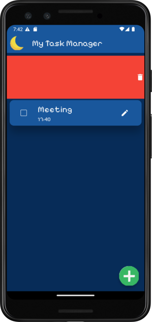

# My Task Manager To-Do Application

A simple and cute to-do application..

The ToDo Application is a simple and user-friendly mobile app 
that helps users manage their daily tasks. It is developed using 
Flutter and works on both Android and iOS platforms.

## Features

* Add, edit, and delete tasks

* Mark tasks as completed

* Day and Night theme support

* Firebase synchronization for tasks

## Screenshots

## Technologies

* Flutter
* Firebase

## Contributing

Contributions are welcome! Please follow these steps:

* Fork the repository.

* Create a new branch (git checkout -b new-feature).

* Commit your changes (git commit -m 'Add new feature').

* Push to the branch (git push origin new-feature).

* Create a Pull Request.

